# PolySwarm Gui

This gui is used to post Bounties, and Offer Channels to the PolySwarm marketplace running on Ethereum.

# Prerequisites

With the newest release, we have moved to running a Sidechain to increase throughput. You now need some NCT & ETH for gas on the main chain, but only to deposit NCT onto the side chain using our relay contract. Once there, we run a POA chain with shorter block times and 0 gas price so there is no need for wallets to have any Eth. 

You can continue to use the same wallet on both chains. You can transfer, post bounties, and open offer channels on the Sidechain like you would on the Mainchain. Once you are finished, you can withdraw the NCT, minus a fee for us to recuperate the gas price of posting the withdrawal transfer on the Mainchain.

# Welcome Screen

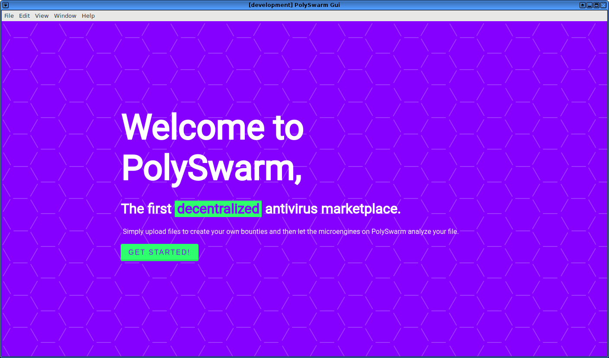

On first launch, you will be greeted with a welcome screen. Click the 'Get Started' button to find the main screen. The Welcome screen is only displayed once.

# Select a key

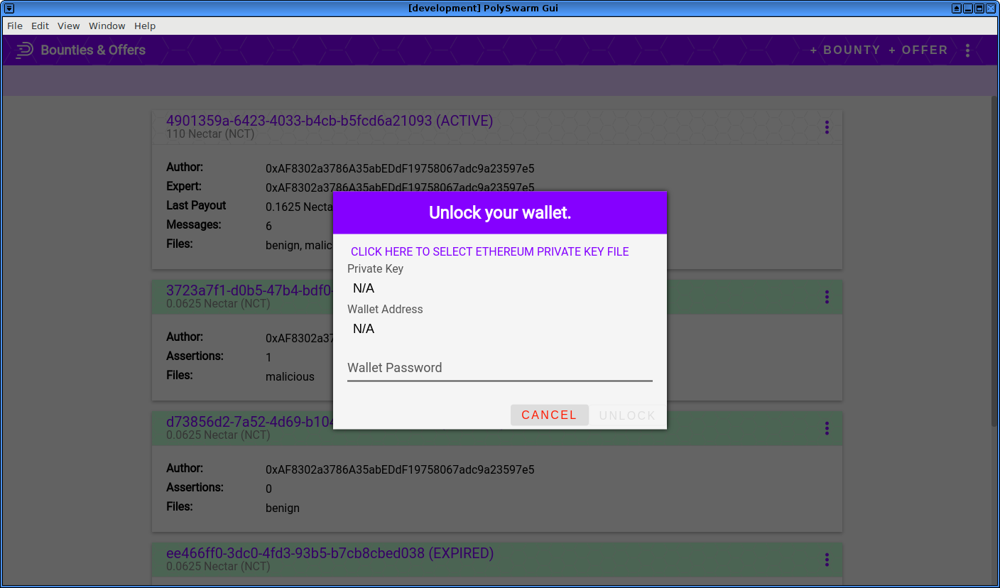

Past the welcome screen the application wants you to select an Etherum private key file & unlock it. The application listens for requests from polyswarmd, signs them and pushes them on to
the chain. 

To choose a key, click the button labeled *Click here to select Ethereum private key file.* If you select a proper file, it will pull the address & populate the field for you. Enter the password, and click unlock. 

Every time you open the application you will have to choose the keyfile & enter your password.

# Bounty & Offer List

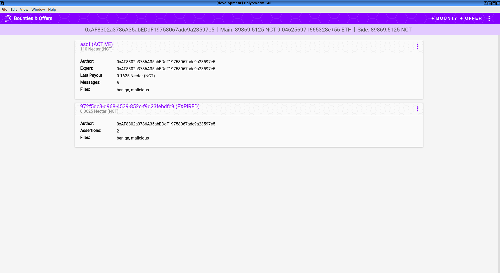

After the Welcome Screen, you will find yourself at a list of bounties and offers. This list is displayed as a series of cards with information about the offer or bounty it represents. Click on these to view more information, or hover over the three-dot menu to see extra options, like View and Delete.

# Creating Bounties

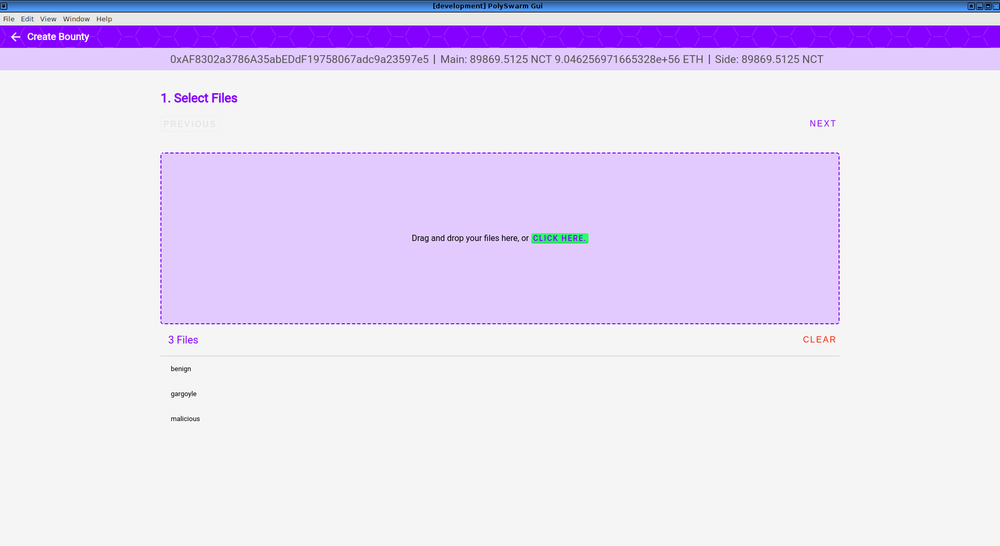
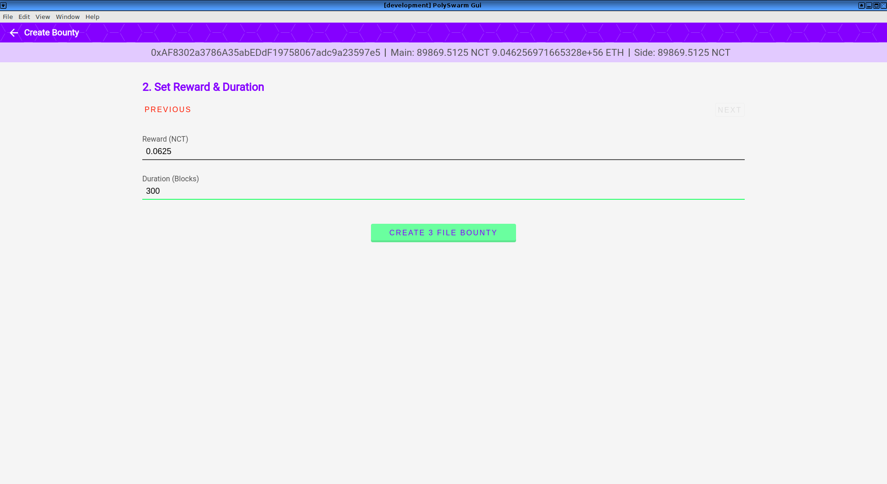

From the Main Screen, click '+ Bounty' in the top header bar. This will open a screen with a set of top buttons, a large drop target, and a list of added files. 
Click the button in the drop target, or drag and drop files to all them. When you have all the files you want added, click 'Next'. This opens the second screen where you can enter your reward amount in Nectar, and the duration of the bounty. The duration is the number of blocks. Each block is about 10-20 seconds. 

Click the 'Create # file Bounty.` This will return you to the main screen, where you can view the bounty, when it is eventually posted to the chain, or create more. 

If an error occurs while the bounty is being posted, a Snack bar will open on the bottom right of the screen with the error received. 

# Viewing Bounty Details & Assertions

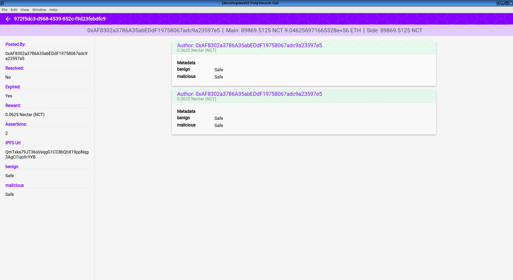

The Main Screen shows a list of bounties. You can delete a bounty from the list by hovering over the 3 dot menu on the upper right side of a bounty card. Bounties are only deleted from your local view. They still exist on the Blockchain. This gives two options, view or delete. You can also view the bounty by clicking anywhere else on the card. 

The Bounty Details screen is two parts. On the left is a summary with some important details about the bounty. We display the author, reward, current status (expired or resolved), and a list of all the files with their final status. The final status comes from the arbiter votes, and may not match with the majority result of expert assertions. 

Expert assertions are shown on the right hand side, as individual cards per assertion. Each card for the assertions displays the expert address, the bid amount, the expert-supplied metadata, and the malicious or safe verdict for each file.

# Creating Offers

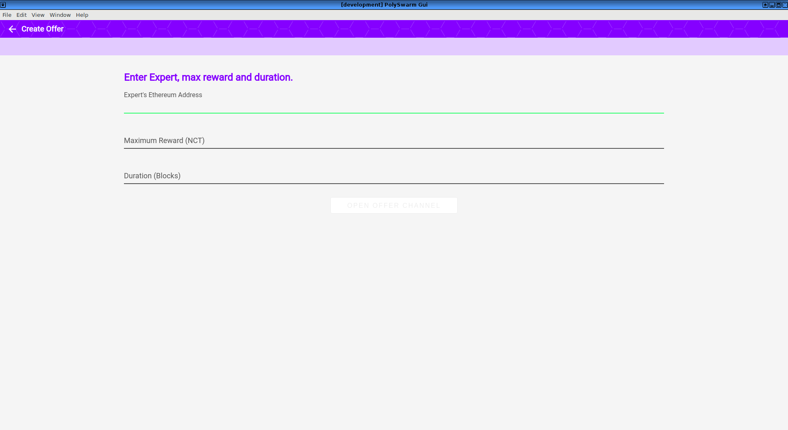

From the Main Screen, click '+ Offer' to open the offer channel screen. Offer channels are meant to be a long running channel between an Ambassador and a reliable security Expert. To create the contract, fill in the required fields: the address of the security expert, the maximum reward for the contract, and a maximum duration for the contract. Click the 'Open Offer Channel' button to open the channel.

# Viewing the offer status

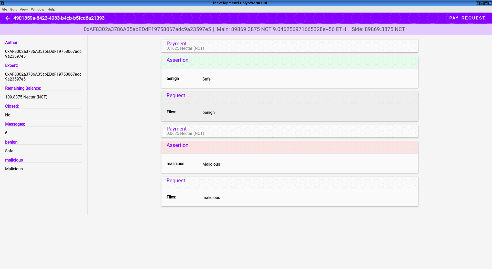

Like bounty details, this screen is divided into two parts. On the left is a summary of the offer to that point, with the author address, the expert address, whether or not it is closed, the current balance, the number of messages, and a list of files with verdicts.

On the right hand side is the list of messages send by the Ambassador and Expert. Offers use a messaging system to communicate the file requests, assertions, and payment. They are displayed in order from most recent at the top, first at the bottom. There are different cards for each type of message. Payments are just the header with the payment amount. Requests show a list of files the Ambassador is asking to be analyzed. The assertion cards list the results of the analysis.

All messages in this context are sent off chain.

## Paying Security experts

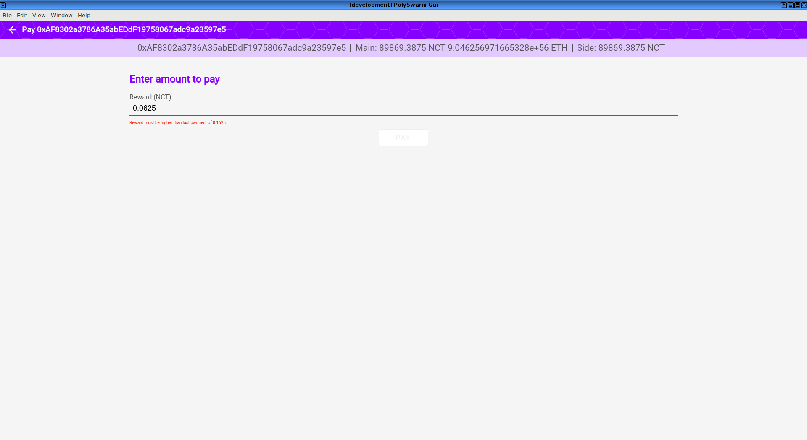

To pay a security expert for work done in relation to an offer channel, click the 'Pay' Button when looking at that offer's details. This is only available if the account signing transactions is the same one used to create the offer channel. Enter the amount and click the 'Pay' Button. 

There are a few validations that must be passed in order to pay the expert. First, a payment must be over the minimum value of 0.0625. Second, the payment value is actually the accumulated max value. You must enter the total value you want to pay the expert. 

## Sending Files for analysis

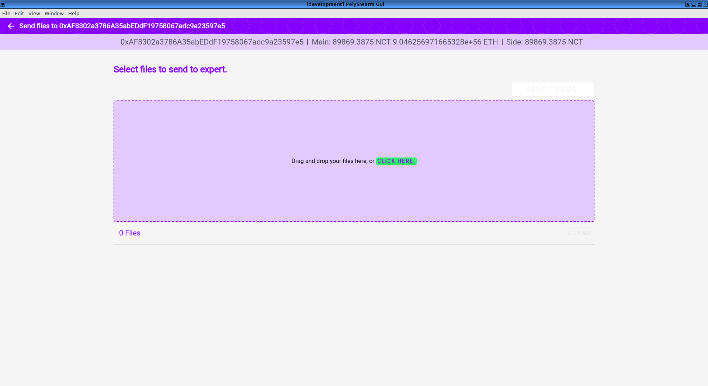

To send files for analysis, click the 'Request' button in the header. This will open a screen with a drop target, and file list, much like the bounty creation screen. Add files by drag and dropping them, or clicking the button inside the drop target. When the you are satisfied with the files, click 'Send Files' above the drop target. Check for responses in the main offer details screen, where the Expert response assertion messages will be shown with verdicts for files.

# Funding the Sidechain

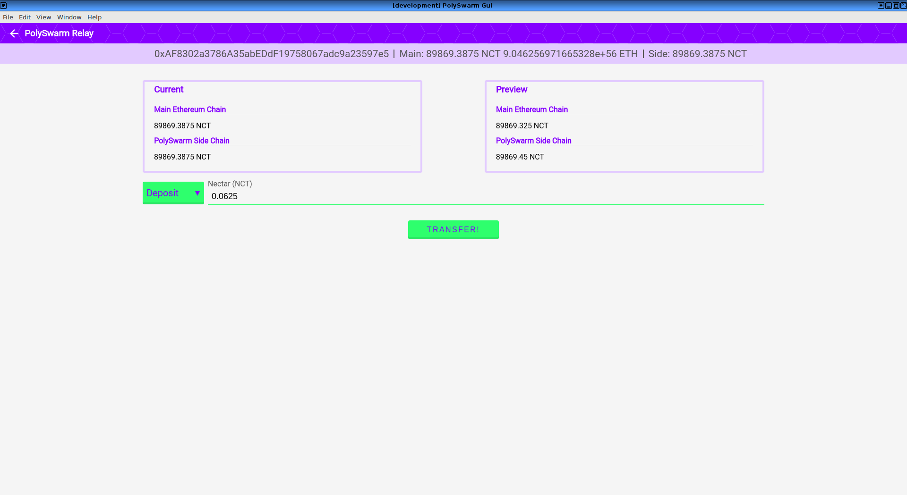

The main PolySwarm contracts exist on a Sidechain that Swarm Technologies is running. You need a way to transfer NCT to the Sidechain and use it with the contracts.

To access the Relay screen, hover over the three dot menu in the header. Click the 'Relay' button. On the resulting screen, you can choose whether to make a deposit or withdrawal. By Default,
it is set to deposit. Choose a direction by hovering over the green button-like element labeled 'Deposit. Click Withdraw or Deposit to change it. You will see the Preview update with the new values. 

Once the direction is set, put a value into the Nectar Input field. Click the 'Transfer' button to open a modal window. You can choose the address to send funds from and unlock it with a password. Deposits and withdrawals take some time before the Nectar appears in your account in either direction. We wait for several confirmations to make sure we are on the main chain, and that the deposit/withdrawal won't be undone. 

You can also use the relay without this gui. Send a deposit to the Ethereum main chain relay contract address, which you can find in the polyswarmd repository.

**You can use the same wallet across both chains.**

**Depositing to the sidechain requires a second geth setup. It must be running on the main chain so that we can submit transactions.**

# Running the Application

This application uses Electron to operate as a desktop application, no browser required. We provide .deb, .rpm and .exe versions of the application. Install the appropriate package for the host operating system. (Sorry, no macOS, yet). Before running the application, make sure  both geth and IPFS are running.

Start geth with `geth --rpc --rpcapi "eth,web3,personal,net" --ws --wsaddr "0.0.0.0" --wsport 8546 --wsapi "eth,web3,personal,net,debug" --wsorigins "*"`

We expect geth rpc top be on 8545 and IPFS on 5001.

Once everything is running & configured, run `polyswarm-gui` to launch the application.

When running from source, install node, and electron-forge. Run `electron-forge start` to launch.

# Running on Rinkeby

If you need to run tests and need to deploy to Rinkeby for some tests, there are a couple things to change.

1. Add the `--rinkeby` option to geth. 
2. Edit the polyswarmd.cfg file (example below) with Rinkeby contract addresses (We don't provide any, but new contracts can be deployed with truffle).

```polyswarm.cfg
NECTAR_TOKEN_ADDRESS = '0x0000000000000000000000000000000000000000'
BOUNTY_REGISTRY_ADDRESS = '0x0000000000000000000000000000000000000000'
```

# Bounty Cost

Posting a bounty requires at minimum 1/16 NCT as the reward. The contract adds an additional 1/16 NCT as a fee paid to the Arbiters. This means each bounty costs at minimum 2/16 NCT in addition to the gas for sending transactions. 

# Relay Cost

Withdrawals from the relay cost gas for the confirmations posted & transferring ETH. To recuperate this cost, the relay charges some NCT for withdrawals. 